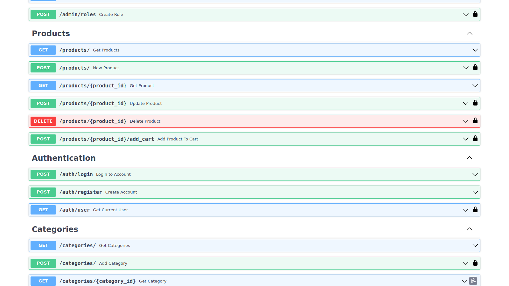

# **FastCommerce**
FastCommerce is an API for E-commerce shop developed using Python FastAPI  and supports SQL databases(MySQL, PostgreSQL,Oracle,SQLite,etc)

The API has most of the functionality of an ecommerce website with some features in progress.

## Features

- Users RoleBased Authentication(JWT)
- Customers
- Sellers  - **In Progress**
- Products (Items)
- Cart
- Categories
- Payments(MPesa)  - **In Progress**
- Orders - In Progress
- Administration
    - Manage Users(Customers and Sellers)
    - Manage Payments - **@TODO**
    - Manage Products
    - Manage Roles
    - Manage Categories

 

- Documentation(OpenAI Documentation)

 
 

## Images

## Author
---
Name: Benard Chumba

Email: chumba101benard@gmail.com

---